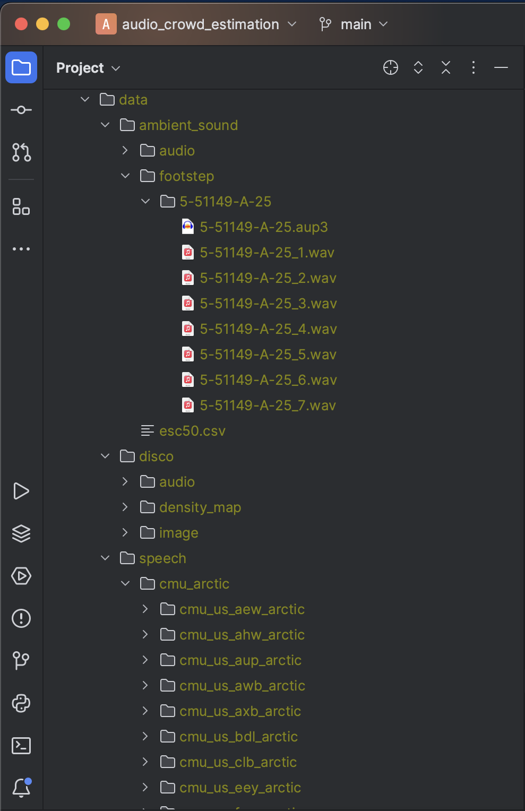

# audio_crowd_estimation
## Installation
- for mac
```commandline
python -m venv venv
source venv/bin/activate
pip install -r requirement-cpu.txt
```

- for windows with gpu
```commandline
python -m venv venv
venv¥Script¥activate
pip install -r requirement.txt
```

## Data preparation
### speech audio
You can download speech audio dataset as belows:
```pycon
from simulation.util import Data
Data.get_cmu_arctic()
```

### ambient sound
You can download ambient sound dataset as following URL.
- https://github.com/karolpiczak/ESC-50

### DISCO dataset

### folder structure for dataset


## How to execute
### Audio simulation (footstep) from people flow trajectories

```commandline
python -m simulation.util -c ./workspace/gis/test_f1.csv -s ./workspace/gis/room/marunouchi.shp -o ./workspace/sim/f1
```

### Audio crowd estimation

```commandline
python -m analysis.model_training -opt cv -i ./workspace/sim/f1 -o ./workspace/sim/f1/model2 -d sim -e 10
```